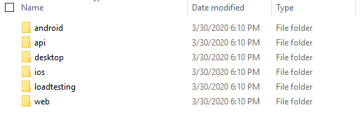
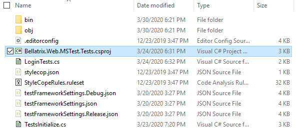

# BELLATRIX Tailor-made Test Automation Framework
Customize and extend our cross-platform .NET framework to perfectly fit your needs. Start on top of hundreds of best practice features and integrations.

Contains the full source code of BELLATRIX Test Automation Framework and Templates for faster usage

BELLATRIX is not a single thing it contains multiple framework libraries, extensions and tools. The tool is built to be cross-platform, however some of the features can be used under Windows since they are written for Visual Studio.

Simple Installation
------------------
1. Download the BELLATRIX projects as a zip file from the Code green button in the right corner.
2. Unzip it. The projects are grouped by technology: web, desktop, mobile, API, load testing



3. Open the project based on the test framework you prefer: MSTest or NUnit.


4. Click on the csproj file.



5. Run the sample tests.
6. You can try to write a simple test yourself.
7. For an in-depth revision of all framework features you can open the getting started projects.

How to use starter kits?
------------------
The starter kits are one of the greatest features of BELLATRIX. For each module- web, API, desktop, mobile you have a project containing demos and explanations about each specific of the framework. Moreover, the starter kit contains exercises for you after each chapter.
1. Download the BELLATRIX projects zip file from the email you received after the downloading step.
2. Unzip it. The projects are grouped by technology: web, desktop, mobile, API, load testing
3. Open the getting started project based on the test framework you prefer.
4. Click on the csproj file.
5. Run the sample tests.
6. You can try to write a simple test yourself.


Running Tests through CLI
--------------------------
 To execute your tests via command line in Continues Integration (CI), you can use the native .NET Core test runner.
1. Navigate to the folder of your test project.
2. Open the CMD there.
3. Execute the following command:

```
dotnet test
```
For applying filters and other more advanced configuration check the official documentation [https://docs.microsoft.com/en-us/dotnet/core/tools/dotnet-test](https://docs.microsoft.com/en-us/dotnet/core/tools/dotnet-test "dotnet test") and [https://docs.microsoft.com/en-us/dotnet/core/tools/dotnet-vstest](https://docs.microsoft.com/en-us/dotnet/core/tools/dotnet-vstest "dotnet vstest").

Both MSTest and NUnit are supported.
Space Requirements
------------------
You need **~240 MB of free space** (full installation on Windows)

**Note**: The space can vary based on which OS you install BELLATRIX. Also, the installer installs templates for each installed version of Visual Studio which can increase the space requirements.

Supported Code Editors
----------------------
The recommended code editor for writing BELLATRIX tests is Visual Studio 2019 or higher (preferably installed on Windows).

NOTE: After the support for .NET Framework 5.0 and higher, Microsoft officially not support .NET Core development in older versions of Visual Studio 2015, 2017 and so on.

### Other Supported Editors: ###
- Visual Studio Code
- Visual Studio for Mac
- Rider: Cross-platform .NET IDE

**Note**: Keep in mind that some of the BELLATRIX are working only for Visual Studio on Windows, other editors don't support them. These features are: **VS item templates** and **VS snippets**.

SDKs and Frameworks Prerequisites
-------------------------------- 
[**.NET Core SDK 5**](https://www.microsoft.com/net/download/windows) or higher (usually comes with Visual Studio installation or updates)

For BELLATRIX desktop modules you need to download [**WinAppDriver**](https://github.com/Microsoft/WinAppDriver/releases). You need to make sure it is started before running any BELLATRIX desktop tests.

For BELLATRIX mobile modules you need to download and install [**Appium**](http://appium.io/). You need to make sure it is started before running any BELLATRIX mobile tests.
