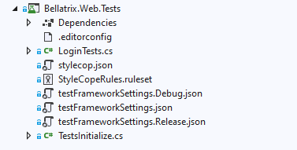
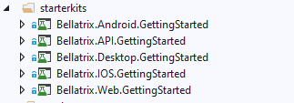

# BELLATRIX Tailor-made Test Automation Framework
Customize and extend our cross-platform .NET framework to perfectly fit your needs. Start on top of hundreds of best practice features and integrations.

Contains the full source code of BELLATRIX Test Automation Framework and Templates for faster usage

BELLATRIX is not a single thing it contains multiple framework libraries, extensions and tools. The tool is built to be cross-platform, however some of the features can be used under Windows since they are written for Visual Studio.

Simple Installation
------------------
1. Download the BELLATRIX projects as a zip file from the Code green button in the right corner.
2. Unzip it. Open BellatrixTestFramework.sln in Visual Studio 
3. Open one of the preconfigured projects. It works for both MSTest and NUnit without additional configuration.



4. Run the sample tests.
5. You can try to write a simple test yourself.
6. For an in-depth revision of all framework features you can open the getting started projects.

How to use starter kits?
------------------
The starter kits are one of the greatest features of BELLATRIX. For each module- web, API, desktop, mobile you have a project containing demos and explanations about each specific of the framework. Moreover, the starter kit contains exercises for you after each chapter.
1. Download the BELLATRIX projects zip file from the email you received after the downloading step.
2. Unzip it. The projects are grouped by technology: web, desktop, mobile, API, load testing
3. Open the getting started project based on the test framework you prefer.
4. Click on the csproj file.
5. Run the sample tests.
6. You can try to write a simple test yourself.



Running Tests through CLI
--------------------------
 To execute your tests via command line in Continues Integration (CI), you can use the native .NET Core test runner.
1. Navigate to the folder of your test project.
2. Open the CMD there.
3. Execute the following command:

```
dotnet test
```
For applying filters and other more advanced configuration check the official documentation [https://docs.microsoft.com/en-us/dotnet/core/tools/dotnet-test](https://docs.microsoft.com/en-us/dotnet/core/tools/dotnet-test "dotnet test") and [https://docs.microsoft.com/en-us/dotnet/core/tools/dotnet-vstest](https://docs.microsoft.com/en-us/dotnet/core/tools/dotnet-vstest "dotnet vstest").

Both MSTest and NUnit are supported.

## Release Strategy

### Versioning
Our project uses [Semantic Versioning](https://semver.org/) (SemVer) for clear and predictable version management. Each release is tagged with a unique version number that reflects the nature of the changes made.
### Tags and Releases
-   **Tags:** We create Git tags for each release to mark specific points in the project's history, making it easier for users to switch between versions.
-   **Release Notes:** Detailed notes accompany [each release](https://bellatrix.solutions/roadmap/release-3-9-0-0-lyra/), highlighting new features, bug fixes, and any breaking changes.
### Accessing Releases
Users can access the specific releases directly from our GitHub repository's Releases page or BELLATRIX website's roadmap section. Each release includes a tag, a summary of changes, and assets (if applicable).

## Integrating BELLATRIX as a Submodule in Your Project
### Adding BELLATRIX as a Submodule
To leverage a specific version of BELLATRIX in your project, you can add it as a Git submodule. This allows you to keep your copy of BELLATRIX up to date or locked to a specific version, depending on your project's needs.
1.  **Navigate to Your Project Directory:** Open a terminal and change to the directory where your project is located.
2.  **Add BELLATRIX as a Submodule:** Use the following Git command to add BELLATRIX as a submodule to your project:
```
git submodule add https://github.com/BELLATRIX-Library/BELLATRIX.git path/to/submodule
``` 
Replace `path/to/submodule` with the relative path within your project where you'd like the BELLATRIX submodule to reside.
**Initialize and Clone the Submodule:** If you're adding the submodule for the first time, initialize your local configuration file and clone the BELLATRIX repository as follows:
```
git submodule update --init --recursive
```
### Checking Out a Specific Tag (Release Version)
After adding BELLATRIX as a submodule, you might want to use a specific release version rather than the latest commit on the main branch.
1.  **Navigate to the Submodule Directory:** Change into the BELLATRIX submodule directory within your project:
```
cd path/to/submodule
```
1.  **Fetch All Tags from the BELLATRIX Repository:** To ensure you have a list of all available tags, fetch them:
```
git fetch --tags
```
2.  **Checkout the Desired Tag:** Check out the specific tag (release version) you want to use by replacing `<tagname>` with the desired version:
```   
git checkout tags/<tagname>` 
```
For example, if you want to check out version `v3.9.0.0`, you would use:
```git checkout tags/v3.9.0.0``` 

3.  **Commit the Submodule Change:** Navigate back to your project's root directory, and commit the change to the submodule reference:
```
cd ../..
git add path/to/submodule
git commit -m "Update BELLATRIX submodule to v3.9.0.0"
```
This process ensures that your project uses a specific, fixed version of BELLATRIX, providing stability and consistency across environments or deployments.

## Contributing to Our Project
We welcome contributions from the community, whether it's in the form of bug reports, feature requests, documentation improvements, or code contributions.
### Getting Started
1.  **Fork the Repository:** Start by forking the repository to your GitHub account. This provides you with a personal workspace for making changes.
2.  **Clone Your Fork:** Clone your fork to your local machine to start working on the changes.
### Making Changes
1.  **Create a Feature Branch:** From your fork, create a new branch for your work. This keeps your changes organized and separate from the main branch.
2.  **Commit Your Changes:** Make your changes locally, and commit them to your feature branch. Use clear and descriptive commit messages.
### Submitting Contributions
1.  **Pull from Upstream:** Before submitting your contribution, pull the latest changes from the upstream main branch into your feature branch to minimize merge conflicts.
2.  **Push to Your Fork:** Push your changes to your fork on GitHub.
3.  **Open a Pull Request (PR):** Submit a pull request from your feature branch to the main branch of the original repository. Provide a clear description of your changes and any relevant issue numbers.
### Code Review
**Review Process:** Your PR will be reviewed by the project maintainers. They may provide feedback or request changes. Be open to discussion and willing to make adjustments as needed.
### After Your PR is Merged
Once your PR is merged, your contributions will become part of the project. You can then safely delete your feature branch.

Space Requirements
------------------
You need **~240 MB of free space** (full installation on Windows)

**Note**: The space can vary based on which OS you install BELLATRIX. Also, the installer installs templates for each installed version of Visual Studio which can increase the space requirements.

Supported Code Editors
----------------------
The recommended code editor for writing BELLATRIX tests is Visual Studio 2019 or higher (preferably installed on Windows).

NOTE: After the support for .NET Framework 5.0 and higher, Microsoft officially not support .NET Core development in older versions of Visual Studio 2015, 2017 and so on.

### Other Supported Editors: ###
- Visual Studio Code
- Visual Studio for Mac
- Rider: Cross-platform .NET IDE

**Note**: Keep in mind that some of the BELLATRIX are working only for Visual Studio on Windows, other editors don't support them. These features are: **VS item templates** and **VS snippets**.

SDKs and Frameworks Prerequisites
-------------------------------- 
[**.NET Core SDK 5**](https://www.microsoft.com/net/download/windows) or higher (usually comes with Visual Studio installation or updates)

For BELLATRIX desktop modules you need to download [**WinAppDriver**](https://github.com/Microsoft/WinAppDriver/releases). You need to make sure it is started before running any BELLATRIX desktop tests.

For BELLATRIX mobile modules you need to download and install [**Appium**](http://appium.io/). You need to make sure it is started before running any BELLATRIX mobile tests.
